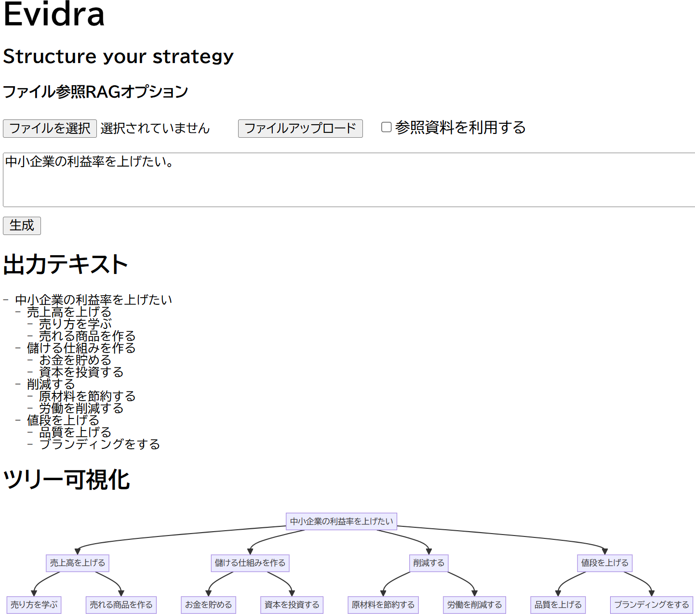

# Evidra


Evidra は、自然言語やアップロードしたファイル（CSV/PDF）をもとに戦略ロジックツリー（ROICツリー・ToC）を自動生成・可視化するフルスタックプロジェクトです。ローカル環境版ではRAGが使えます。Webアプリ版ではRender上のデータサイズ制限によりRAGが使えません。

[▶︎Webアプリ版はこちら](https://evidra-prototype-01.onrender.com/)



- **フロントエンド**: React + Vite + Mermaid.js  
- **バックエンド**: FastAPI + Together.ai Inference API + RAG (FAISS)

---

## リポジトリ構成

```text
.
├── backend/           # FastAPI サーバ
│   ├── main.py        # エンドポイント定義
│   └── .env           # 環境変数 (gitignore 推奨)
│   └── requirements.txt 
├── frontend/          # React クライアント
│   ├── assets/        # ロゴなど画像リソース
│   ├── src/
│   │   ├── App.jsx
│   │   ├── MermaidGraph.jsx
│   │   └── main.jsx
│   ├── index.html
│   ├── package.json
│   ├── vite.config.js
│   └── ...
└── render.yaml        # Render.com 用自動デプロイ設定
```
## ローカル開発環境構築

### 前提条件
- Node.js (v16+) / npm  
- Python (3.9+) / pip  
- Git  

### 1. リポジトリをクローン
```bash
git clone <REPO_URL>
cd <repository>
```
### 2. バックエンドセットアップ
```bash
cd backend
python -m venv venv
source venv/bin/activate    # Windows: venv\Scripts\activate
pip install -r requirements.txt
```

環境変数設定
backend/.env に以下を記載：
```dotenv
TOGETHER_API_KEY=sk-XXXXXXXXXXXXXXXXXXXX
```
※ Together.ai の Add Key で生成した API キーを使用。

サーバ起動
```bash
uvicorn main:app --reload --port 8000
```
OpenAPI: http://localhost:8000/docs

### 3. フロントエンドセットアップ
```bash
cd ../frontend
npm install
npm run dev
```
アプリ: http://localhost:5173
